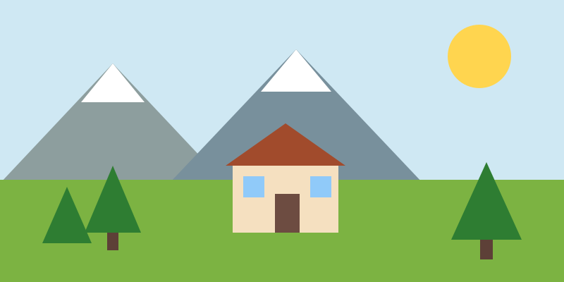
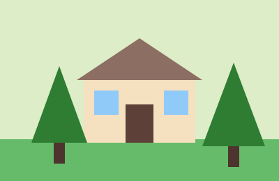
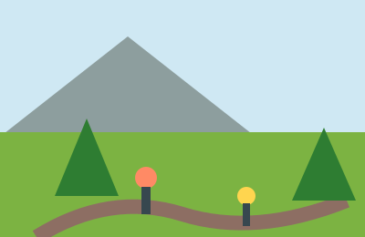
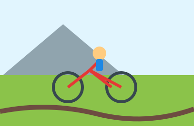
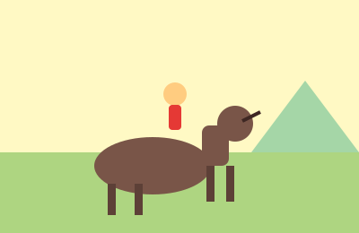

# Apuntes para aprender esta página web desde 0

Este documento está pensado para alguien que está empezando en HTML y CSS. La idea es que lo leas como si fuera un cuaderno de clase: sencillo, claro y con ejemplos.

---

## 1. ¿Qué es esta página?

Es una web de turismo rural llamada Escapada Natural. Tiene varias páginas:

- Inicio
- Alojamientos
- Galería
- Contacto

Cada página tiene la misma estructura general:

- cabecera
- menú
- contenido principal
- barra lateral
- pie de página

---

## 2. ¿Qué es HTML?

HTML sirve para crear la estructura de la página.

Por ejemplo:

- `header` = cabecera
- `nav` = menú
- `main` = contenido principal
- `aside` = barra lateral
- `footer` = pie
- `section` = una parte de la página
- `h1`, `h2`, `h3` = títulos
- `p` = párrafo
- `img` = imagen
- `a` = enlace
- `form` = formulario

### Ejemplo sencillo

```html
<h1>Escapada Natural</h1>
<p>Bienvenidos a nuestra web.</p>
<a href="contacto.html">Contacto</a>
```

Esto se ve así en la página:

- un título grande
- un párrafo
- un enlace que lleva a otra página

---

## 3. ¿Qué es CSS?

CSS sirve para darle estilo a la HTML.

Con CSS puedes cambiar:

- colores
- márgenes
- tamaño de texto
- bordes
- sombras
- posición de elementos
- efectos al pasar el ratón

### Ejemplo sencillo

```css
body {
    background-color: #eef5ee;
    font-family: Arial, sans-serif;
}
```

Esto hace que todo el fondo de la página sea verde muy claro y la fuente sea Arial.

---

## 4. ¿Qué son las clases?

Las clases son nombres que le damos a los elementos para poder aplicarle estilos.

Ejemplo:

```html
<header class="cabecera">
```

Y luego en CSS:

```css
.cabecera {
    background-color: #2f5d3a;
    color: white;
}
```

Eso significa: "todos los elementos con la clase cabecera tendrán ese estilo".

Es una forma muy útil de repetir estilos en varios sitios.

---

## 5. Estructura general de una página HTML

Toda página empieza así:

```html
<!DOCTYPE html>
<html lang="es">
<head>
    <meta charset="UTF-8">
    <meta name="viewport" content="width=device-width, initial-scale=1.0">
    <title>Escapada Natural</title>
    <link rel="stylesheet" href="../css/estilos.css">
</head>
<body>

</body>
</html>
```

### Qué significa cada parte

- `<!DOCTYPE html>`: dice que el documento es HTML5
- `<html>`: abre el documento HTML
- `<head>`: información del documento, no se ve en la página
- `<meta charset="UTF-8">`: permite usar letras como ñ y acentos
- `<title>`: título que aparece en la pestaña del navegador
- `<link rel="stylesheet" href="...">`: conecta con el archivo CSS
- `<body>`: todo lo que sí se ve en la página

---

## 6. La cabecera: `header`

La cabecera es la parte superior. En esta web la cabecera tiene:

- logo
- nombre de la empresa
- frase motivadora

### HTML

```html
<header class="cabecera">
    
    <div class="cabecera-texto">
        <h1>Escapada Natural</h1>
        <p class="frase">Desconecta del ruido y reconecta con la naturaleza</p>
    </div>
</header>
```

### CSS

```css
.cabecera {
    width: 100%;
    height: 180px;
    background-color: #2f5d3a;
    color: white;
    display: flex;
    align-items: center;
    padding: 0 2rem;
}
```

### Explicación

- `width: 100%` = ocupa todo el ancho
- `height: 180px` = altura fija
- `background-color` = color de fondo
- `display: flex` = pone el logo y el texto en línea
- `align-items: center` = centra verticalmente

---

## 7. El menú: `nav`

El menú sirve para moverse entre las páginas.

### HTML

```html
<nav class="menu">
    <ul>
        <li><a href="index.html">Inicio</a></li>
        <li><a href="alojamientos.html">Alojamientos</a></li>
        <li><a href="galeria.html">Galería</a></li>
        <li><a href="contacto.html">Contacto</a></li>
    </ul>
</nav>
```

### CSS

```css
.menu {
    width: 100%;
    height: 70px;
    background-color: #4c8a5a;
}

.menu ul {
    list-style: none;
    text-align: center;
    margin: 0;
    padding: 0;
}

.menu li {
    display: inline-block;
}

.menu a {
    color: white;
    text-decoration: none;
    padding: 0 1.2rem;
}
```

### Qué hace aquí

- `ul` elimina los puntos de la lista
- `li` pone los enlaces uno al lado del otro
- `a` quita el subrayado y cambia el color

---

## 8. El contenedor principal

La estructura principal es así:

```html
<div class="contenedor">
    <main class="principal"> ... </main>
    <aside class="barra-lateral"> ... </aside>
</div>
```

La idea es: a la izquierda el contenido principal y a la derecha información extra.

### CSS

```css
.contenedor {
    width: 90%;
    margin: 2rem auto;
    display: flex;
    gap: 1.5rem;
}

.principal {
    width: 70%;
}

.barra-lateral {
    width: 30%;
}
```

### Explicación

- `width: 90%` = ocupa casi todo el ancho
- `margin: auto` = lo centra
- `display: flex` = deja dos columnas
- `gap` = separa una columna de otra

---

## 9. La sección de inicio: `presentacion`

Esta parte es la introducción de la web.

### HTML

```html
<section class="presentacion">
    <h2>Bienvenidos a Escapada Natural</h2>
    <p>Texto explicativo...</p>
    
</section>
```

### CSS

```css
.presentacion {
    background-color: white;
    border-radius: 10px;
    padding: 1.5rem;
}

.foto-grande {
    width: 100%;
    height: auto;
    border-radius: 10px;
}
```

### Qué hace

- la imagen ocupa todo el ancho disponible
- mantiene proporciones con `height: auto`
- tiene bordes redondeados

---

## 10. La tabla de precios

La tabla se usa para mostrar información organizada en filas y columnas.

### HTML

```html
<table>
    <thead>
        <tr>
            <th>Alojamiento</th>
            <th>Capacidad</th>
            <th>Precio/noche</th>
        </tr>
    </thead>
    <tbody>
        <tr>
            <td>Casa del Bosque</td>
            <td>4 personas</td>
            <td>90 €</td>
        </tr>
    </tbody>
</table>
```

### CSS

```css
.precios table {
    width: 100%;
    border-collapse: collapse;
}

.precios th,
.precios td {
    border: 2px solid #4c8a5a;
    padding: 0.6rem;
    text-align: center;
}
```

### Explicación

- `table` crea la tabla
- `thead` es la cabecera
- `tbody` es el cuerpo
- `th` son las columnas del encabezado
- `td` son las celdas

---

## 11. La barra lateral: `aside`

La barra lateral suele contener información secundaria, como:

- actividades recomendadas
- horarios
- enlaces útiles

### HTML

```html
<aside class="barra-lateral">
    <section>
        <h3>Actividades sugeridas</h3>
        <ul>
            <li>Senderismo</li>
            <li>Rutas en bicicleta</li>
        </ul>
    </section>
</aside>
```

### CSS

```css
.barra-lateral {
    background-color: #e3f0e3;
    padding: 1.2rem;
    border-radius: 10px;
}
```

### Qué hace

- separa la información secundaria de la principal
- hace que la web se vea más ordenada
- ayuda a la navegación o a mostrar datos útiles

---

## 12. La sección de alojamientos

La página de alojamientos tiene varias tarjetas con información de cada casa o cabaña.

### HTML

```html
<article class="ficha">
    
    <h3>Casa del Bosque</h3>
    <p>Descripción del alojamiento</p>
    <p class="precio">90 € / noche</p>
    <a class="enlace-ficha" href="contacto.html">Más información</a>
</article>
```

### CSS

```css
.ficha {
    display: inline-block;
    width: calc(33.333% - 1.2rem);
    background-color: #f7fbf7;
    border: 2px solid #4c8a5a;
    padding: 1rem;
    border-radius: 8px;
}
```

### Explicación

- `article` representa cada alojamiento
- `ficha` es la tarjeta que contiene imagen, texto y botón
- `inline-block` permite poner varias tarjetas en la misma línea

---

## 13. La galería

La galería se usa para mostrar varias imágenes ordenadas.

### HTML

```html
<div class="galeria">
    
    
    
</div>
```

### CSS

```css
.galeria {
    display: flex;
    flex-wrap: wrap;
    gap: 1rem;
}

.galeria img {
    width: calc(33.333% - 0.7rem);
    border-radius: 8px;
}
```

### Explicación

- `display: flex` organiza las imágenes
- `flex-wrap` permite que bajen a otra línea si no caben
- `gap` separa las imágenes

---

## 14. El formulario de contacto

El formulario sirve para que el usuario deje sus datos.

### HTML

```html
<form action="#" method="post">
    <div class="campo">
        <label for="nombre">Nombre:</label>
        <input type="text" id="nombre" name="nombre">
    </div>
</form>
```

### CSS

```css
.campo {
    display: inline-block;
    width: calc(50% - 0.6rem);
    margin: 0.4rem 0.3rem;
}

.campo input {
    width: 100%;
    padding: 0.45rem;
    border: 1px solid #a5c9a5;
    border-radius: 5px;
}
```

### Explicación

- `input` recoge datos del usuario
- `label` pone texto junto al campo
- `select` sirve para elegir una opción
- `textarea` sirve para escribir comentarios

---

## 15. El pie de página: `footer`

El pie es la parte final de la página. Normalmente tiene:

- nombre del sitio
- dirección
- teléfono
- correo
- copyright

### HTML

```html
<footer class="pie">
    <p class="pie-nombre">Escapada Natural</p>
    <p>Camino de la Sierra, 12</p>
    <p class="copyright">&copy; 2026 Escapada Natural</p>
</footer>
```

### CSS

```css
.pie {
    background-color: #1e3d27;
    color: white;
    text-align: center;
    padding: 1.2rem;
}
```

---

## 16. Qué es `display: flex` y por qué se usa tanto

`display: flex` es una de las herramientas más importantes de CSS.

Se usa para organizar cosas en fila o columna.

### Ejemplo

```css
.contenedor {
    display: flex;
}
```

Esto hace que los elementos dentro del contenedor se coloquen en línea.

Si quieres ponerlos en columnas, también puedes hacerlo así:

```css
.contenedor {
    display: flex;
    flex-direction: column;
}
```

Eso sería una columna vertical.

---

## 17. Qué es `hover`

`hover` ocurre cuando pasamos el ratón por encima de un elemento.

### Ejemplo

```css
.menu a:hover {
    background-color: #1e3d27;
    color: #ffe9a8;
}
```

Esto hace que el enlace cambie de color cuando lo señalamos.

Es un efecto muy común y muy útil en web.

---

## 18. Qué es `border-radius`

`border-radius` redondea los bordes.

```css
border-radius: 10px;
```

Esto hace que los elementos se vean más suaves y modernos.

---

## 19. Qué es `box-shadow`

`box-shadow` da una sombra a un bloque para que parezca más elevado.

```css
box-shadow: 0 3px 8px rgba(0, 0, 0, 0.15);
```

Eso le da profundidad a la caja.

---

## 20. Cómo se “piensa” una página web

La clave es dividir la página en bloques:

1. cabecera
2. menú
3. contenido principal
4. barra lateral
5. pie de página

Cuando ya sabes esto, luego vas rellenando cada bloque con su contenido.

### Ejemplo mental

```text
cabecera
  └── logo + nombre + frase
menu
  └── enlaces
contenido
  ├── presentación
  ├── precios
  ├── galería
  └── formulario
barra lateral
  ├── actividades
  ├── horarios
  └── enlaces
pie
  └── datos de contacto
```

Así es como se organiza una web real.

---

## 21. Cómo crear la web paso a paso

### Paso 1: crea la carpeta del proyecto

```text
proyecto/
├── css/
├── html/
├── img/
```

### Paso 2: crea el archivo CSS

Archivo: `css/estilos.css`

### Paso 3: crea la primera página

Archivo: `html/index.html`

### Paso 4: escribe la estructura básica

```html
<header>...</header>
<nav>...</nav>
<main>...</main>
<aside>...</aside>
<footer>...</footer>
```

### Paso 5: añade contenido

- texto
- imágenes
- listas
- tablas
- formulario

### Paso 6: diseña con CSS

Cambia colores, tamaños y espacios.

### Paso 7: repite la misma base en las otras páginas

- alojamientos
- galería
- contacto

---

## 22. Consejos para estudiar mejor

- No intentes memorizar todo de golpe
- Haz una cosa a la vez: primero HTML, luego CSS
- Cambia un color y mira el resultado
- Prueba cambiar textos e imágenes
- Si algo no funciona, revisa si el nombre de la clase coincide en HTML y CSS

### Error muy común

Si en HTML pones:

```html
<section class="presentacion">
```

y en CSS escribes:

```css
.presentacionn {
    color: red;
}
```

No funciona porque el nombre no coincide exactamente.

Eso es muy importante: nombres iguales en CSS y HTML.

---

## 23. Resumen final

En esta página hemos visto varias cosas:

- HTML crea la estructura
- CSS da el estilo
- las clases sirven para reutilizar estilos
- `header`, `nav`, `main`, `aside` y `footer` son bloques básicos
- con flex y columnas puedes crear una web con dos partes
- una galería y un formulario son bastante fáciles si ya sabes la base

No hace falta memorizarlo todo de golpe. Lo importante es entender la lógica:

- primero se estructura la página
- luego se diseña
- luego se repite en otras páginas

---

## 24. Frase clave para recordar

La web se construye por bloques.

Cada bloque tiene una función, y cada bloque tiene un estilo.

Si entiendes eso, ya sabes mucho más de lo que parece.

---

## 25. Siguiente paso recomendado

Si quieres seguir aprendiendo, te recomiendo hacer estas prácticas:

1. Cambiar colores del CSS
2. Cambiar textos de la web
3. Añadir otra imagen a la galería
4. Hacer un nuevo botón con otro estilo
5. Crear una nueva página sencilla con una sección nueva

Cuando practiques, aprenderás mucho más rápido que leyendo solo.

---

## 26. Conclusión

Esta web parece complicada, pero en realidad está hecha con bloques muy simples.

Si sabes:

- qué es HTML
- qué es CSS
- qué es una clase
- cómo se organizan las secciones

ya tienes la base para crear páginas web por tu cuenta.

Y eso es lo más importante en este momento: entender la lógica, no memorizar todo.
