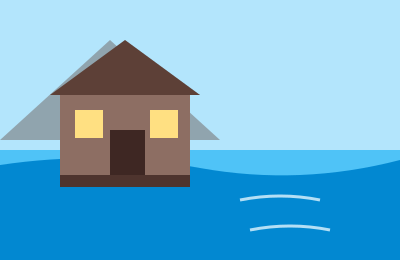
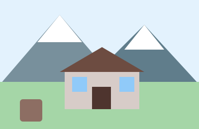
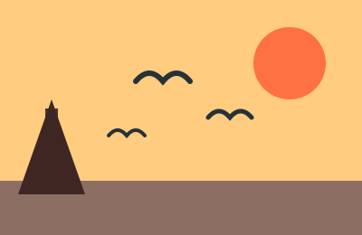
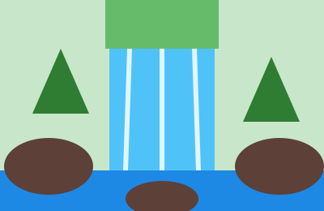
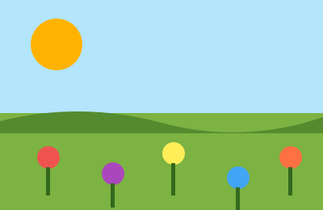

# Tutorial: cómo crear esta página web desde cero

Este tutorial explica, paso a paso, cómo construir una web tipo turismo rural con varias páginas: inicio, alojamientos, galería y contacto. Está pensado para aprender desde 0 y entender cada parte del proyecto.

## 1. Qué vamos a crear

Vamos a hacer una web con estas páginas:

- Inicio
- Alojamientos
- Galería
- Contacto

La web tendrá:

- una cabecera con logo y nombre
- un menú de navegación
- una zona principal con contenido
- una barra lateral
- un pie de página
- un diseño en verde, tierra y crema, con estilo de página de turismo rural

---

## 2. Estructura del proyecto

La estructura de carpetas que usamos es esta:

```text
c_ejercicio_final/
├── css/
│   └── estilos.css
├── html/
│   ├── index.html
│   ├── alojamientos.html
│   ├── galeria.html
│   └── contacto.html
├── img/
└── estructura_para_crear_la_web/
    └── enunciado_web_completa_html_css_final.md
```

Explicación:

- `html/` guarda las páginas HTML
- `css/` guarda el archivo de estilos
- `img/` guarda imágenes y gráficos SVG

---

## 3. Antes de empezar: conceptos básicos

### HTML

HTML sirve para crear la estructura de la página. Define elementos como:

- encabezados (`h1`, `h2`, `h3`)
- párrafos (`p`)
- listas (`ul`, `li`)
- imágenes (`img`)
- enlaces (`a`)
- formularios (`form`, `input`, `textarea`)

### CSS

CSS sirve para dar estilo a esos elementos:

- colores
- tamaños
- margen y padding
- bordes
- sombras
- posición de columnas
- hover (cuando pasas el ratón)

### Clases y selectores

En CSS usamos clases como `.cabecera`, `.menu`, `.principal`, `.barra-lateral`.

Ejemplo:

```css
.cabecera {
    background-color: green;
    color: white;
}
```

Esto hace que todos los elementos con `class="cabecera"` tengan ese estilo.

---

## 4. Cómo empezar con una página HTML

Toda página HTML sigue esta estructura base:

```html
<!DOCTYPE html>
<html lang="es">
<head>
    <meta charset="UTF-8">
    <meta name="viewport" content="width=device-width, initial-scale=1.0">
    <title>Mi página</title>
    <link rel="stylesheet" href="../css/estilos.css">
</head>
<body>

</body>
</html>
```

Qué significa cada parte:

- `<!DOCTYPE html>`: indica que es HTML5
- `<html lang="es">`: documento en español
- `<head>`: metadatos, título, CSS, charset
- `<body>`: todo lo visible de la página
- `<link rel="stylesheet" href="../css/estilos.css">`: conecta la página con el CSS

---

## 5. Archivo HTML: `index.html`

Este es el archivo principal de la home.

```html
<!DOCTYPE html>
<html lang="es">

<head>
    <meta charset="UTF-8">
    <meta name="viewport" content="width=device-width, initial-scale=1.0">
    <title>Inicio - Escapada Natural</title>
    <link rel="stylesheet" href="../css/estilos.css">
</head>

<body>

    <header class="cabecera">
        
        <div class="cabecera-texto">
            <h1>Escapada Natural</h1>
            <p class="frase">Desconecta del ruido y reconecta con la naturaleza</p>
        </div>
    </header>

    <nav class="menu">
        <ul>
            <li><a class="activo" href="index.html">Inicio</a></li>
            <li><a href="alojamientos.html">Alojamientos</a></li>
            <li><a href="galeria.html">Galería</a></li>
            <li><a href="contacto.html">Contacto</a></li>
        </ul>
    </nav>

    <div class="contenedor">

        <main class="principal">

            <section class="presentacion">
                <h2>Bienvenidos a Escapada Natural</h2>
                <p>
                    En Escapada Natural ofrecemos casas y cabañas rurales en pleno
                    entorno de montaña, ideales para desconectar del ritmo de la ciudad.
                    Todos nuestros alojamientos están cuidados hasta el último detalle
                    para que solo te preocupes de disfrutar.
                </p>
                <p>
                    Organizamos actividades guiadas, rutas de senderismo, paseos en
                    bicicleta y visitas culturales por los pueblos de la zona. Ya sea que
                    vengas en familia, en pareja o con amigos, tenemos una escapada
                    hecha a tu medida.
                </p>
                
            </section>

            <section class="precios">
                <h2>Tabla de precios</h2>
                <table>
                    <thead>
                        <tr>
                            <th>Alojamiento</th>
                            <th>Capacidad</th>
                            <th>Precio/noche</th>
                            <th>Desayuno</th>
                        </tr>
                    </thead>
                    <tbody>
                        <tr>
                            <td>Casa del Bosque</td>
                            <td>4 personas</td>
                            <td>90 €</td>
                            <td>Incluido</td>
                        </tr>
                        <tr>
                            <td>Cabaña del Lago</td>
                            <td>2 personas</td>
                            <td>75 €</td>
                            <td>Incluido</td>
                        </tr>
                        <tr>
                            <td>Casa de Montaña</td>
                            <td>6 personas</td>
                            <td>120 €</td>
                            <td>No incluido</td>
                        </tr>
                    </tbody>
                </table>
            </section>

        </main>

        <aside class="barra-lateral">
            <section>
                <h3>Actividades sugeridas</h3>
                <ul>
                    <li>Senderismo</li>
                    <li>Rutas en bicicleta</li>
                    <li>Paseos a caballo</li>
                    <li>Visitas guiadas</li>
                    <li>Observación de aves</li>
                </ul>
            </section>
            <section class="horarios">
                <h3>Horarios</h3>
                <ul>
                    <li>Recepción: 8:00 – 22:00</li>
                    <li>Check-in: a partir de 15:00</li>
                    <li>Check-out: antes de 11:00</li>
                </ul>
            </section>
            <section class="relacionados">
                <h3>Enlaces relacionados</h3>
                <ul>
                    <li><a href="galeria.html">Galería de fotos</a></li>
                    <li><a href="alojamientos.html">Ver alojamientos</a></li>
                    <li><a href="contacto.html">Reservar ahora</a></li>
                </ul>
            </section>
        </aside>

    </div>

    <footer class="pie">
        <div class="pie-datos">
            <p class="pie-nombre">Escapada Natural</p>
            <p>Camino de la Sierra, 12 - 28680 San Martín de Valdeiglesias</p>
            <p>Teléfono: 918 456 789 | Correo: info@escapadanatural.es</p>
        </div>
        <p class="copyright">&copy; 2026 Escapada Natural. Todos los derechos reservados.</p>
    </footer>

</body>

</html>
```

### Explicación

- `header` crea la parte superior
- `nav` crea el menú
- `main` contiene la parte principal del contenido
- `aside` crea la barra lateral
- `footer` crea el pie de página
- `section` separa bloques lógicos

---

## 6. Archivo HTML: `alojamientos.html`

```html
<!DOCTYPE html>
<html lang="es">

<head>
    <meta charset="UTF-8">
    <meta name="viewport" content="width=device-width, initial-scale=1.0">
    <title>Alojamientos - Escapada Natural</title>
    <link rel="stylesheet" href="../css/estilos.css">
</head>

<body>

    <header class="cabecera">
        
        <div class="cabecera-texto">
            <h1>Escapada Natural</h1>
            <p class="frase">Desconecta del ruido y reconecta con la naturaleza</p>
        </div>
    </header>

    <nav class="menu">
        <ul>
            <li><a href="index.html">Inicio</a></li>
            <li><a class="activo" href="alojamientos.html">Alojamientos</a></li>
            <li><a href="galeria.html">Galería</a></li>
            <li><a href="contacto.html">Contacto</a></li>
        </ul>
    </nav>

    <div class="contenedor">

        <main class="principal">

            <section id="alojamientos" class="alojamientos">
                <h2>Nuestros alojamientos</h2>

                <article class="ficha">
                    
                    <h3>Casa del Bosque</h3>
                    <p>Casa acogedora de dos plantas rodeada de robles, con chimenea
                        y terraza privada.</p>
                    <p class="precio">90 € / noche</p>
                    <a class="enlace-ficha" href="contacto.html">Más información</a>
                </article>

                <article class="ficha ficha-2">
                    
                    <h3>Cabaña del Lago</h3>
                    <p>Cabaña de madera para dos personas junto al lago, perfecta
                        para parejas que buscan tranquilidad.</p>
                    <p class="precio">75 € / noche</p>
                    <a class="enlace-ficha" href="contacto.html">Más información</a>
                </article>

                <article class="ficha ficha-3">
                    
                    <h3>Casa de Montaña</h3>
                    <p>Amplia casa de piedra para seis personas con vistas a los
                        picos y gran salón con hogar.</p>
                    <p class="precio">120 € / noche</p>
                    <a class="enlace-ficha" href="contacto.html">Más información</a>
                </article>
            </section>

        </main>

        <aside class="barra-lateral">
            <section>
                <h3>Actividades sugeridas</h3>
                <ul>
                    <li>Senderismo</li>
                    <li>Rutas en bicicleta</li>
                    <li>Paseos a caballo</li>
                    <li>Visitas guiadas</li>
                    <li>Observación de aves</li>
                </ul>
            </section>
            <section class="horarios">
                <h3>Horarios</h3>
                <ul>
                    <li>Recepción: 8:00 – 22:00</li>
                    <li>Check-in: a partir de 15:00</li>
                    <li>Check-out: antes de 11:00</li>
                </ul>
            </section>
            <section class="relacionados">
                <h3>Enlaces relacionados</h3>
                <ul>
                    <li><a href="index.html">Ver precios</a></li>
                    <li><a href="galeria.html">Galería de fotos</a></li>
                    <li><a href="contacto.html">Reservar ahora</a></li>
                </ul>
            </section>
        </aside>

    </div>

    <footer class="pie">
        <div class="pie-datos">
            <p class="pie-nombre">Escapada Natural</p>
            <p>Camino de la Sierra, 12 - 28680 San Martín de Valdeiglesias</p>
            <p>Teléfono: 918 456 789 | Correo: info@escapadanatural.es</p>
        </div>
        <p class="copyright">&copy; 2026 Escapada Natural. Todos los derechos reservados.</p>
    </footer>

</body>

</html>
```

### Qué se aprende aquí

- `article` se usa para contenido independiente
- `class="ficha"` crea cada tarjeta de alojamiento
- `ficha-2` y `ficha-3` son variaciones de color
- los `a` dentro de cada tarjeta llevan a más información o a contacto

---

## 7. Archivo HTML: `galeria.html`

```html
<!DOCTYPE html>
<html lang="es">

<head>
    <meta charset="UTF-8">
    <meta name="viewport" content="width=device-width, initial-scale=1.0">
    <title>Galería - Escapada Natural</title>
    <link rel="stylesheet" href="../css/estilos.css">
</head>

<body>

    <header class="cabecera">
        
        <div class="cabecera-texto">
            <h1>Escapada Natural</h1>
            <p class="frase">Desconecta del ruido y reconecta con la naturaleza</p>
        </div>
    </header>

    <nav class="menu">
        <ul>
            <li><a href="index.html">Inicio</a></li>
            <li><a href="alojamientos.html">Alojamientos</a></li>
            <li><a class="activo" href="galeria.html">Galería</a></li>
            <li><a href="contacto.html">Contacto</a></li>
        </ul>
    </nav>

    <div class="contenedor">

        <main class="principal">

            <section id="galeria" class="galeria-zona">
                <h2>Galería de imágenes</h2>
                <div class="galeria">
                    
                    
                    
                    
                    
                    
                </div>
            </section>

        </main>

        <aside class="barra-lateral">
            <section>
                <h3>Actividades sugeridas</h3>
                <ul>
                    <li>Senderismo</li>
                    <li>Rutas en bicicleta</li>
                    <li>Paseos a caballo</li>
                    <li>Visitas guiadas</li>
                    <li>Observación de aves</li>
                </ul>
            </section>
            <section class="horarios">
                <h3>Horarios</h3>
                <ul>
                    <li>Recepción: 8:00 – 22:00</li>
                    <li>Check-in: a partir de 15:00</li>
                    <li>Check-out: antes de 11:00</li>
                </ul>
            </section>
            <section class="relacionados">
                <h3>Enlaces relacionados</h3>
                <ul>
                    <li><a href="index.html">Ver precios</a></li>
                    <li><a href="alojamientos.html">Ver alojamientos</a></li>
                    <li><a href="contacto.html">Reservar ahora</a></li>
                </ul>
            </section>
        </aside>

    </div>

    <footer class="pie">
        <div class="pie-datos">
            <p class="pie-nombre">Escapada Natural</p>
            <p>Camino de la Sierra, 12 - 28680 San Martín de Valdeiglesias</p>
            <p>Teléfono: 918 456 789 | Correo: info@escapadanatural.es</p>
        </div>
        <p class="copyright">&copy; 2026 Escapada Natural. Todos los derechos reservados.</p>
    </footer>

</body>

</html>
```

### Qué se aprende aquí

- Se usan varias imágenes en una cuadrícula
- La clase `galeria` organiza fotos con `display: flex`
- `flex-wrap` permite que las imágenes pasen a la siguiente línea si no caben
- `hover` hace que la imagen crezca ligeramente al pasar el ratón

---

## 8. Archivo HTML: `contacto.html`

```html
<!DOCTYPE html>
<html lang="es">

<head>
    <meta charset="UTF-8">
    <meta name="viewport" content="width=device-width, initial-scale=1.0">
    <title>Contacto - Escapada Natural</title>
    <link rel="stylesheet" href="../css/estilos.css">
</head>

<body>

    <header class="cabecera">
        
        <div class="cabecera-texto">
            <h1>Escapada Natural</h1>
            <p class="frase">Desconecta del ruido y reconecta con la naturaleza</p>
        </div>
    </header>

    <nav class="menu">
        <ul>
            <li><a href="index.html">Inicio</a></li>
            <li><a href="alojamientos.html">Alojamientos</a></li>
            <li><a href="galeria.html">Galería</a></li>
            <li><a class="activo" href="contacto.html">Contacto</a></li>
        </ul>
    </nav>

    <div class="contenedor">

        <main class="principal">

            <section id="contacto" class="contacto-zona">
                <h2>Formulario de contacto</h2>
                <form action="#" method="post">

                    <div class="campo">
                        <label for="nombre">Nombre:</label>
                        <input type="text" id="nombre" name="nombre" placeholder="Tu nombre">
                    </div>

                    <div class="campo">
                        <label for="apellidos">Apellidos:</label>
                        <input type="text" id="apellidos" name="apellidos" placeholder="Tus apellidos">
                    </div>

                    <div class="campo">
                        <label for="email">Correo electrónico:</label>
                        <input type="email" id="email" name="email" placeholder="ejemplo@correo.com">
                    </div>

                    <div class="campo">
                        <label for="telefono">Teléfono:</label>
                        <input type="tel" id="telefono" name="telefono" placeholder="600 000 000">
                    </div>

                    <div class="campo">
                        <label for="tipo">Tipo de alojamiento:</label>
                        <select id="tipo" name="tipo">
                            <option value="">-- Elige una opción --</option>
                            <option value="bosque">Casa del Bosque</option>
                            <option value="cabana">Cabaña del Lago</option>
                            <option value="montana">Casa de Montaña</option>
                        </select>
                    </div>

                    <div class="campo">
                        <label for="entrada">Fecha de entrada:</label>
                        <input type="date" id="entrada" name="entrada">
                    </div>

                    <div class="campo">
                        <label for="personas">Número de personas:</label>
                        <input type="number" id="personas" name="personas" min="1" max="6" value="2">
                    </div>

                    <div class="campo campo-completo">
                        <label for="observaciones">Observaciones:</label>
                        <textarea id="observaciones" name="observaciones" rows="4"
                            placeholder="Cuéntanos qué necesitas..."></textarea>
                    </div>

                    <button type="submit" class="boton">Enviar solicitud</button>

                </form>
            </section>

        </main>

        <aside class="barra-lateral">
            <section>
                <h3>Actividades sugeridas</h3>
                <ul>
                    <li>Senderismo</li>
                    <li>Rutas en bicicleta</li>
                    <li>Paseos a caballo</li>
                    <li>Visitas guiadas</li>
                    <li>Observación de aves</li>
                </ul>
            </section>
            <section class="horarios">
                <h3>Horarios</h3>
                <ul>
                    <li>Recepción: 8:00 – 22:00</li>
                    <li>Check-in: a partir de 15:00</li>
                    <li>Check-out: antes de 11:00</li>
                </ul>
            </section>
            <section class="relacionados">
                <h3>Enlaces relacionados</h3>
                <ul>
                    <li><a href="index.html">Ver precios</a></li>
                    <li><a href="alojamientos.html">Ver alojamientos</a></li>
                    <li><a href="galeria.html">Galería de fotos</a></li>
                </ul>
            </section>
        </aside>

    </div>

    <footer class="pie">
        <div class="pie-datos">
            <p class="pie-nombre">Escapada Natural</p>
            <p>Camino de la Sierra, 12 - 28680 San Martín de Valdeiglesias</p>
            <p>Teléfono: 918 456 789 | Correo: info@escapadanatural.es</p>
        </div>
        <p class="copyright">&copy; 2026 Escapada Natural. Todos los derechos reservados.</p>
    </footer>

</body>

</html>
```

### Qué se aprende aquí

- `form` sirve para recoger datos del usuario
- `input` recoge texto, email, teléfono, número y fecha
- `select` sirve para elegir una opción
- `textarea` sirve para escribir comentarios
- `button` crea el botón de enviar

---

## 9. Archivo CSS: `estilos.css`

Este es el archivo principal que da estilo a toda la página web.

```css
/* ============================================================
   EJERCICIO: WEB COMPLETA DE TURISMO RURAL - "Escapada Natural"
   Archivo CSS externo (estilos.css) - sin JavaScript
   Colores naturales: verdes, tierra y crema
   ============================================================ */

html {
    font-size: 20px;
}

* {
    box-sizing: border-box;
}

body {
    margin: 0;
    padding: 0;
    font-family: Arial, Helvetica, sans-serif;
    background-color: #eef5ee;
    color: #333333;
}

.cabecera {
    width: 100%;
    height: 180px;
    background-color: #2f5d3a;
    color: #ffffff;
    border-bottom: 5px solid #1e3d27;
    display: flex;
    align-items: center;
    padding: 0 2rem;
}

.logo {
    width: 120px;
    height: 120px;
    margin-right: 1.5rem;
}

.cabecera-texto h1 {
    margin: 0;
    font-size: 2.2rem;
}

.frase {
    margin: 0.3rem 0 0 0;
    font-size: 1rem;
    font-style: italic;
    color: #d8ecd8;
}

.menu {
    width: 100%;
    height: 70px;
    background-color: #4c8a5a;
    border-bottom: 3px solid #2f5d3a;
}

.menu ul {
    margin: 0;
    padding: 0;
    list-style: none;
    height: 100%;
    text-align: center;
    line-height: 70px;
}

.menu li {
    display: inline-block;
    vertical-align: middle;
}

.menu a {
    display: inline-block;
    color: #ffffff;
    text-decoration: none;
    font-size: 1rem;
    padding: 0 1.2rem;
    height: 100%;
    cursor: pointer;
    transition: background-color 0.3s, color 0.3s;
}

.menu a:hover {
    background-color: #1e3d27;
    color: #ffe9a8;
}

.menu a.activo {
    background-color: #1e3d27;
    color: #ffe9a8;
    font-weight: bold;
}

.contenedor {
    width: 90%;
    margin: 2rem auto;
    display: flex;
    align-items: stretch;
    gap: 1.5rem;
}

.principal {
    width: 70%;
    min-height: 60vh;
}

.presentacion,
.alojamientos,
.precios {
    background-color: #ffffff;
    border: 1px solid #cfe3cf;
    border-radius: 10px;
    box-shadow: 0 3px 8px rgba(0, 0, 0, 0.15);
    padding: 1.5rem;
    margin-bottom: 1.5rem;
}

.principal h2 {
    margin-top: 0;
    font-size: 1.5rem;
    color: #2f5d3a;
    border-bottom: 2px solid #4c8a5a;
    padding-bottom: 0.4rem;
}

.principal p {
    font-size: 0.9rem;
    line-height: 1.5;
}

.foto-grande {
    display: block;
    width: 100%;
    max-width: 100%;
    height: auto;
    margin-top: 1rem;
    border-radius: 10px;
}

.alojamientos {
    font-size: 0;
}

.ficha {
    display: inline-block;
    vertical-align: top;
    width: calc(33.333% - 1.2rem);
    margin: 0.6rem;
    background-color: #f7fbf7;
    border: 2px solid #4c8a5a;
    border-radius: 8px;
    padding: 1rem;
    font-size: 0.9rem;
    transition: box-shadow 0.3s, transform 0.3s;
}

.ficha-2 {
    border-color: #795548;
    background-color: #fdf8f2;
}

.ficha-3 {
    border-color: #1565c0;
    background-color: #f2f7fd;
    box-shadow: 0 4px 10px rgba(21, 101, 192, 0.25);
}

.ficha:hover {
    box-shadow: 0 6px 14px rgba(0, 0, 0, 0.25);
    transform: translateY(-4px);
}

.ficha img {
    display: block;
    width: 100%;
    height: auto;
    border-radius: 6px;
    margin-bottom: 0.6rem;
}

.ficha h3 {
    margin: 0 0 0.4rem 0;
    font-size: 1.1rem;
    color: #2f5d3a;
}

.ficha p {
    margin: 0 0 0.5rem 0;
}

.ficha .precio {
    font-weight: bold;
    color: #e65100;
    font-size: 1rem;
}

.enlace-ficha {
    display: inline-block;
    background-color: #4c8a5a;
    color: #ffffff;
    text-decoration: none;
    padding: 0.4rem 0.9rem;
    border-radius: 5px;
    font-size: 0.85rem;
    cursor: pointer;
    transition: background-color 0.3s;
}

.enlace-ficha:hover {
    background-color: #1e3d27;
}

.precios table {
    width: 100%;
    border-collapse: collapse;
}

.precios th,
.precios td {
    border: 2px solid #4c8a5a;
    padding: 0.6rem;
    text-align: center;
    font-size: 0.9rem;
}

.precios th {
    background-color: #2f5d3a;
    color: #ffffff;
}

.precios tbody tr:nth-child(even) {
    background-color: #eef5ee;
}

.precios tbody tr {
    transition: background-color 0.3s;
}

.precios tbody tr:hover {
    background-color: #d8ecd8;
}

.barra-lateral {
    width: 30%;
    background-color: #e3f0e3;
    border: 1px solid #cfe3cf;
    border-radius: 10px;
    box-shadow: 0 3px 8px rgba(0, 0, 0, 0.15);
    padding: 1.2rem;
    align-self: flex-start;
}

.barra-lateral section {
    margin-bottom: 1.2rem;
}

.barra-lateral h3 {
    font-size: 1.05rem;
    color: #2f5d3a;
    margin: 0 0 0.5rem 0;
    border-bottom: 2px solid #4c8a5a;
    padding-bottom: 0.2rem;
}

.barra-lateral ul {
    margin: 0;
    padding-left: 1.2rem;
    font-size: 0.9rem;
    line-height: 1.6;
}

.barra-lateral a {
    color: #1565c0;
    text-decoration: none;
    cursor: pointer;
    transition: color 0.3s;
}

.barra-lateral a:hover {
    color: #e65100;
    text-decoration: underline;
}

.galeria-zona {
    width: 100%;
    margin: 0 0 1.5rem 0;
    background-color: #ffffff;
    border: 1px solid #cfe3cf;
    border-radius: 10px;
    box-shadow: 0 3px 8px rgba(0, 0, 0, 0.15);
    padding: 1.5rem;
}

.galeria-zona h2 {
    margin-top: 0;
    font-size: 1.5rem;
    color: #2f5d3a;
    border-bottom: 2px solid #4c8a5a;
    padding-bottom: 0.4rem;
}

.galeria {
    display: flex;
    flex-wrap: wrap;
    justify-content: space-between;
    gap: 1rem;
}

.galeria img {
    width: calc(33.333% - 0.7rem);
    height: auto;
    border-radius: 8px;
    box-shadow: 0 3px 8px rgba(0, 0, 0, 0.25);
    cursor: pointer;
    transition: transform 0.3s;
}

.galeria img:hover {
    transform: scale(1.06);
}

.contacto-zona {
    width: 100%;
    margin: 0 0 1.5rem 0;
    background-color: #ffffff;
    border: 1px solid #cfe3cf;
    border-radius: 10px;
    box-shadow: 0 3px 8px rgba(0, 0, 0, 0.15);
    padding: 1.5rem;
}

.contacto-zona h2 {
    margin-top: 0;
    font-size: 1.5rem;
    color: #2f5d3a;
    border-bottom: 2px solid #4c8a5a;
    padding-bottom: 0.4rem;
}

.contacto-zona form {
    font-size: 0;
}

.campo {
    display: inline-block;
    vertical-align: top;
    width: calc(50% - 0.6rem);
    margin: 0.4rem 0.3rem;
    font-size: 0.9rem;
}

.campo-completo {
    width: calc(100% - 0.6rem);
}

.campo label {
    display: block;
    font-weight: bold;
    margin-bottom: 0.25rem;
    color: #2f5d3a;
}

.campo input,
.campo select,
.campo textarea {
    width: 100%;
    padding: 0.45rem;
    border: 1px solid #a5c9a5;
    border-radius: 5px;
    font-size: 0.9rem;
    font-family: Arial, Helvetica, sans-serif;
    background-color: #f7fbf7;
    cursor: pointer;
    transition: border-color 0.3s, box-shadow 0.3s;
}

.campo input:focus,
.campo select:focus,
.campo textarea:focus {
    border-color: #2f5d3a;
    box-shadow: 0 0 5px rgba(47, 93, 58, 0.4);
    outline: none;
}

.boton {
    display: block;
    margin: 1rem auto;
    background-color: #2f5d3a;
    color: #ffffff;
    border: none;
    border-radius: 6px;
    padding: 0.7rem 2rem;
    font-size: 1rem;
    cursor: pointer;
    transition: background-color 0.3s, transform 0.2s;
}

.boton:hover {
    background-color: #4c8a5a;
    transform: scale(1.05);
}

.pie {
    width: 100%;
    min-height: 120px;
    background-color: #1e3d27;
    color: #ffffff;
    text-align: center;
    padding: 1.2rem;
    border-top: 5px solid #4c8a5a;
}

.pie .pie-nombre {
    font-size: 1.2rem;
    font-weight: bold;
    margin: 0 0 0.4rem 0;
}

.pie p {
    margin: 0.2rem 0;
    font-size: 0.9rem;
}

.pie .copyright {
    margin-top: 0.8rem;
    font-size: 0.8rem;
    color: #a5c9a5;
}
```

---

## 10. Explicación de los conceptos más importantes del CSS

### `display: flex`

Se usa para poner elementos en fila o columna. En este proyecto se usa en:

- cabecera
- menú
- contenedor principal
- galería

```css
.contenedor {
    display: flex;
}
```

### `width: 90%` y `margin: auto`

Esto centra el bloque horizontalmente.

```css
.contenedor {
    width: 90%;
    margin: 2rem auto;
}
```

### `gap`

Separa los elementos dentro de un contenedor flex.

```css
.contenedor {
    gap: 1.5rem;
}
```

### `border-radius`

Redondea bordes para que la web se vea más moderna.

```css
border-radius: 10px;
```

### `box-shadow`

Añade una sombra para crear profundidad.

```css
box-shadow: 0 3px 8px rgba(0, 0, 0, 0.15);
```

### `hover`

Hace que un elemento cambie al pasar el ratón.

```css
.menu a:hover {
    background-color: #1e3d27;
}
```

### `transition`

Suaviza los cambios de estilo.

```css
transition: background-color 0.3s, color 0.3s;
```

---

## 11. Cómo hacer la web desde 0 paso a paso

### Paso 1: crea la estructura

Crea primero estas carpetas:

```text
proyecto/
├── css/
├── html/
├── img/
```

### Paso 2: crea el CSS

Crea el archivo `css/estilos.css` y pon el código base.

### Paso 3: crea la cabecera

Haz un `header` con logo, h1 y subtítulo.

```html
<header class="cabecera">
    
    <div class="cabecera-texto">
        <h1>Escapada Natural</h1>
        <p class="frase">Texto descriptivo</p>
    </div>
</header>
```

### Paso 4: crea el menú

```html
<nav class="menu">
    <ul>
        <li><a href="index.html">Inicio</a></li>
        <li><a href="alojamientos.html">Alojamientos</a></li>
        <li><a href="galeria.html">Galería</a></li>
        <li><a href="contacto.html">Contacto</a></li>
    </ul>
</nav>
```

### Paso 5: crea el contenedor principal

```html
<div class="contenedor">
    <main class="principal"> ... </main>
    <aside class="barra-lateral"> ... </aside>
</div>
```

### Paso 6: crea la primera página con texto e imagen

Usa `section` para organizar contenido.

```html
<section class="presentacion">
    <h2>Bienvenidos</h2>
    <p>Texto de presentación</p>
    
</section>
```

### Paso 7: crea la tabla de precios

```html
<table>
    <thead>
        <tr>
            <th>Alojamiento</th>
            <th>Capacidad</th>
            <th>Precio</th>
        </tr>
    </thead>
    <tbody>
        <tr>
            <td>Casa del Bosque</td>
            <td>4 personas</td>
            <td>90 €</td>
        </tr>
    </tbody>
</table>
```

### Paso 8: crea la sección de alojamientos

Usa `article` para cada caso.

```html
<article class="ficha">
    
    <h3>Casa del Bosque</h3>
    <p>Descripción</p>
    <p class="precio">90 € / noche</p>
    <a class="enlace-ficha" href="contacto.html">Más información</a>
</article>
```

### Paso 9: crea la galería

```html
<div class="galeria">
    
    
    
</div>
```

### Paso 10: crea el formulario de contacto

```html
<form action="#" method="post">
    <div class="campo">
        <label for="nombre">Nombre:</label>
        <input type="text" id="nombre" name="nombre">
    </div>
</form>
```

### Paso 11: crea el footer

```html
<footer class="pie">
    <p class="pie-nombre">Escapada Natural</p>
    <p>Dirección</p>
    <p class="copyright">&copy; 2026</p>
</footer>
```

---

## 12. Cómo abrir la página en el navegador

1. Guarda tu archivo `index.html`
2. Abre la carpeta con tu navegador
3. Haz doble clic en `index.html`
4. Si quieres ver la navegación, abre cada HTML desde el navegador

Si usas Visual Studio Code, también puedes pulsar:

- Open with Live Server si tienes la extensión instalada

---

## 13. Consejos para practicar

- Cambia colores del CSS y observa el resultado
- Modifica textos de la página para personalizarla
- Prueba cambiar el tamaño de la cabecera
- Añade más imágenes o cambia el menú
- Crea más secciones siguiendo el mismo patrón

---

## 14. Resumen final

Para hacer una web como esta necesitas entender tres cosas:

1. HTML: estructura de la página
2. CSS: diseño y estilo
3. organización: usar clases para reutilizar estilos

Con esta base, puedes crear cualquier sitio web con varias páginas, un menú, una galería, un formulario y un diseño profesional.

---

## 15. Siguiente nivel

Una vez que domines esto, puedes ampliar la web con:

- más páginas
- animaciones en CSS
- menú responsive para móvil
- formulario real con PHP o JavaScript
- imágenes con mejor calidad
- diseño adaptativo con media queries

---

## 16. Conclusión

Esta página web no es complicada si la miras por partes. Cada bloque tiene una función concreta:

- cabecera: nombre y logo
- menú: navegación
- main: contenido principal
- aside: información extra
- footer: cierre del sitio

Si aprendes las bases de HTML y CSS, podrás construir páginas completas por ti mismo.

"La mejor forma de aprender web es construyendo pequeñas piezas y luego juntándolas." 

---

Si quieres, más adelante puedo hacerte una versión del tutorial aún más didáctica con:

- explicación de cada línea de HTML
- explicación de cada línea de CSS
- una guía para crearla paso a paso desde un archivo vacío
- una versión con comentarios en el propio código para que sea más fácil de seguir
